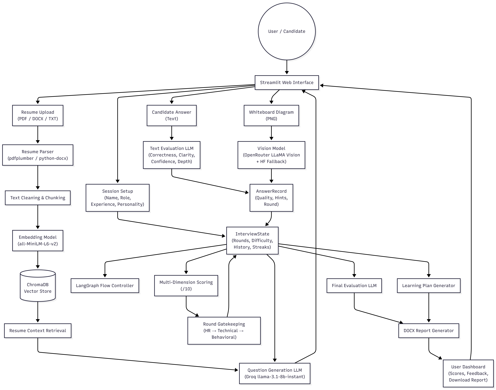

# AI Interviewer (RAG + Whiteboard)
**Employee Name:** Lanka Yesesvini Sai

---

## 1. Research Question / Hypothesis
### Research Question
Can a multi-round, personality-aware AI interview system—integrating large language model (LLM) based evaluation, adaptive difficulty control, semantic repetition detection, and whiteboard vision analysis—accurately assess a candidate’s communication skills, technical depth, correctness, and overall interview readiness in a manner comparable to a human interviewer?

### Hypothesis
An AI-driven interview platform that combines structured HR, Technical, and Behavioral rounds with heuristic and LLM-based scoring, adaptive question difficulty, strict answer repetition detection, and multimodal whiteboard evaluation can generate consistent, explainable, and actionable interview feedback. This approach can effectively identify candidate strengths, weaknesses, and learning needs while maintaining realism, fairness, and reliability comparable to real-world technical interviews.

---

## 2. Motivation and Relevance

## Motivation and Relevance

Technical interviews are often inconsistent, subjective, and difficult to scale, especially when evaluating multiple candidates across different roles and experience levels. Human interviewers may vary in questioning style, difficulty progression, and feedback quality, which can lead to biased or incomplete assessments.

This project is motivated by the need for a structured, scalable, and unbiased interview evaluation system that can simulate real-world interview conditions. By combining multi-round interviews (HR, Technical, Behavioral), adaptive difficulty adjustment, personality-aware questioning, strict answer repetition detection, and whiteboard-based visual reasoning analysis, the system provides a realistic and comprehensive evaluation of a candidate’s skills.

The relevance of this work lies in its practical application to technical hiring, interview preparation platforms, and academic assessment tools. The system not only evaluates candidate performance but also generates detailed feedback, explainable scores, and personalized learning plans, making it valuable for both recruiters and candidates seeking targeted improvement.

---

## 3. System Architecture

  

### Architecture Overview

The AI Interviewer system is designed as a modular, state-driven architecture that simulates a real-world technical interview. It integrates resume-aware question generation, multi-round interview orchestration, adaptive evaluation logic, and multimodal whiteboard analysis to produce structured interview feedback and learning recommendations.

At a high level, the system consists of five main layers:

1. **User Interface Layer**  
   Built using Streamlit, this layer handles candidate input, chat-based interaction, resume upload, whiteboard access, and report downloads.

2. **Interview Orchestration Layer**  
   Implemented using LangGraph and a centralized InterviewState, this layer controls interview flow across HR, Technical, and Behavioral rounds, manages transitions, enforces pass/fail gates, and applies interviewer personality rules.

3. **Question Generation & RAG Layer**  
   Resume content is indexed into ChromaDB and used to generate role-specific, difficulty-aware questions via LLMs. This ensures contextual and personalized interview questions.

4. **Evaluation & Scoring Layer**  
   Candidate answers are evaluated using a hybrid approach:
   - LLM-based judgment (correct, partial, irrelevant)
   Scores are computed across multiple dimensions such as clarity, confidence, technical depth, communication, and correctness.

5. **Whiteboard & Learning Feedback Layer**  
   During technical rounds, candidates can submit diagrams. These are analyzed using a vision-capable LLM, generating feedback and follow-up questions. After the interview, a personalized learning plan and downloadable report are generated.

**Core Components**
- Frontend: Streamlit-based user interface
- Orchestrator: LangGraph state machine
- LLM Layer: Groq / OpenRouter models
- RAG Layer: SentenceTransformers + ChromaDB
- Evaluation Engine: Scoring, hint penalties, verdict logic
- Report Generator: DOCX interview report

---

## 4. Models and Versions Used

## Model(s) and Versions Used

This system uses different Large Language Models (LLMs) for text-based interview logic and vision-based whiteboard analysis. Models are selected based on task requirements such as latency, reasoning quality, and multimodal support.

### Text-Based Language Models
- **LLaMA 3.1 (8B, Instant)**  
  Provider: Groq API  
  Model ID: `llama-3.1-8b-instant`  

  Used for:
  - HR, Technical, and Behavioral question generation
  - Candidate answer evaluation and correctness judgment
  - Intent detection (answer, hint, clarification, repetition)
  - Adaptive difficulty decisions
  - Final interview evaluation summary
  - Learning plan generation

### Vision-Based Language Models (Whiteboard Analysis)
- **LLaMA 3.2 (11B, Vision-Instruct)**  
  Provider: OpenRouter  
  Model ID: `meta-llama/llama-3.2-11b-vision-instruct`  

  Used for:
  - Analyzing uploaded whiteboard diagrams
  - Providing visual feedback on diagrams
  - Generating exactly one diagram-based follow-up interview question

  This model serves as the **primary vision model** for the system’s whiteboard evaluation pipeline.

### Embedding Models
- **Sentence-Transformers (all-MiniLM-L6-v2)**  
  Library: `sentence-transformers`  

  Used for:
  - Resume text embedding
  - Semantic retrieval in the resume-based RAG pipeline using ChromaDB

### Text-Only Fallback Model
- **Mistral 7B Instruct (v0.2)**  
  Provider: Hugging Face  
  Model ID: `mistralai/Mistral-7B-Instruct-v0.2`  

  Used as a fallback for:
  - Generating follow-up questions when vision-based whiteboard analysis is unavailable

All models are integrated without fine-tuning and are accessed via APIs, ensuring modularity and ease of deployment across local and hosted environments.

---

## 5.Prompting and/or Fine-Tuning Strategy

This system does not use model fine-tuning. Instead, it relies entirely on structured prompt engineering to control interviewer behavior, evaluation strictness, and output format across different interview stages.

### Prompting Strategy

1. **Role- and Personality-Aware Prompts**  
   Prompts dynamically include interviewer personality (Friendly Coach, Strict FAANG, Startup Hiring Manager, Professor) to control tone, difficulty, and expectations. This ensures consistent interviewer behavior without retraining models.

2. **Strict Output Constraints**  
   All LLM prompts enforce strict response formats, such as valid JSON-only outputs, single-sentence reactions, or exactly one follow-up question. This prevents hallucinations, enforces determinism, and ensures safe downstream parsing.

3. **Task-Specific Prompt Design**  
   Separate prompts are used for distinct tasks, including:
   - Interview question generation (HR, Technical, Behavioral)
   - Candidate answer evaluation and labeling (correct, partial, irrelevant)
   - Intent detection (answer, hint, clarification, repetition)
   - Whiteboard diagram feedback and follow-up question generation
   - Final interview evaluation summary

4. **Adaptive Difficulty Control via Prompts**  
   Prompt inputs dynamically adjust difficulty level, expected depth, and focus topics based on candidate performance, interviewer personality, and resume context. This simulates real interview progression without modifying model weights.

5. **Fallback Prompting Strategy**  
   When vision-based whiteboard analysis is unavailable, a simplified text-only prompt is used to generate follow-up questions from the candidate’s explanation, ensuring interview continuity.

### Fine-Tuning Strategy

No fine-tuning is applied in this project. All models are used in their pre-trained form and accessed via external APIs. System behavior is controlled exclusively through prompt engineering, rule-based logic, and state-driven orchestration.

---

## 6. Evaluation Protocol

## Evaluation Protocol

The evaluation protocol is designed to simulate a real-world technical interview by combining rule-based heuristics, LLM-based judgment, and multi-round performance aggregation. Candidate performance is evaluated continuously throughout the interview and finalized after all applicable rounds are completed.

### Interview Structure
The interview consists of three sequential rounds:
1. **HR Round** – Assesses communication, clarity, confidence, and situational awareness.
2. **Technical Round** – Evaluates technical correctness, depth of understanding, problem-solving ability, and use of whiteboard diagrams.
3. **Behavioral Round** – Measures decision-making, ownership, and real-world reasoning based on role-specific scenarios.

Progression between rounds is gated using predefined pass thresholds, with the Technical round acting as a strict gatekeeper.

### Per-Answer Evaluation
Each candidate response is evaluated using a hybrid approach:
- **LLM-based classification**: Answers are labeled as correct, partial, alternative, or irrelevant based on interviewer personality strictness.
- **Heuristic scoring**: Responses are scored across multiple dimensions using measurable signals such as answer length, keyword usage, and explanation structure.
- **Hint penalties**: Use of hints reduces clarity and confidence scores to reflect interview realism.
- **Repetition detection**: Near-duplicate or reused answers are blocked and require fresh reasoning.

### Scoring Dimensions
Each valid answer contributes to the following dimensions:
- Technical Depth  
- Correctness  
- Clarity  
- Communication  
- Confidence  

Scores are normalized to a 0–10 scale per dimension and aggregated across all interview rounds.

### Round-Level Scoring
Each interview round is scored independently:
- Scores are based on the ratio of good answers to total questions.
- A small bonus may be applied for effective whiteboard usage during the Technical round.
- Failure to meet the minimum pass mark results in early termination of the interview.

### Final Evaluation
After the interview concludes:
- Dimension scores are aggregated into an overall score.
- Strengths and improvement areas are identified based on score thresholds.
- A final evaluation summary is generated using an LLM, strictly referencing only HR, Technical, and Behavioral rounds.
- A personalized learning plan is produced using identified weaknesses and topic-level performance.

This evaluation protocol ensures consistency, explainability, and fairness while maintaining realistic interview pressure and decision-making.

---

## 7. Key Results

## Key Results (with References to Report Sections)

The system produces a structured and explainable interview outcome based on multi-round evaluation and aggregated scoring.

Key results generated by the system include:
- **Overall Interview Score (/10)** derived from normalized dimension scores  
  *(Report Section: Overall Score, Summary)*

- **Dimension-wise Performance Analysis** covering technical depth, correctness, clarity, communication, and confidence  
  *(Report Section: Skill Breakdown)*

- **Round-wise Evaluation** for HR, Technical, and Behavioral rounds, including pass/fail gating at the Technical stage  
  *(Report Section: Final Evaluation)*

- **Identified Strengths and Improvement Areas** based on score thresholds and answer quality  
  *(Report Section: Strengths, Improvements)*

- **Topic-Level Performance Breakdown** indicating strong and weak subject areas across the interview  
  *(Report Section: Topic Performance)*

- **Final Interview Verdict (Selected / Not Selected)** supported by an LLM-generated evaluation summary  
  *(Report Section: Final Evaluation)*

- **Personalized Learning Plan** with actionable practice steps and recommended resources tailored to weak areas  
  *(Report Section: Learning Roadmap, Recommended Resources)*

These results demonstrate the system’s ability to generate consistent, interpretable, and actionable interview feedback comparable to real-world technical interview assessments.

---

## 8. Known Limitations and Ethical Considerations

### Limitations
- Vision analysis is limited to visible diagram structure
- External LLM APIs introduce latency
- Offline execution is not supported

### Ethical Considerations
- No sensitive or private data is stored
- Resume data is processed locally
- Results are explainable and transparent
- System is for practice and research only

---

## 9. Exact Instructions to Reproduce Results

1. **Clone the repository**
   git clone <repository-url>
   cd ai_interviewer_agent

2. **Create and activate a virtual environment**
    python -m venv venv
    source venv/bin/activate   # Windows: venv\Scripts\activate

3. **Install dependencies**
    pip install -r requirements.txt

4. **Set up environment variables**
    GROQ_API_KEY=your_groq_api_key
    GROQ_TEXT_MODEL=llama-3.1-8b-instant
    OPENROUTER_API_KEY=your_openrouter_api_key
    HF_API_TOKEN=your_huggingface_api_token

5. **Run the application**
    streamlit run src/app.py

6. **Reproduce the interview results**
    -Enter candidate details and select interviewer personality
    -Upload a resume (PDF / DOCX / TXT)
    -Complete the HR, Technical, and Behavioral interview rounds
    -Use the whiteboard feature during the Technical round if required
    -Generate feedback and download the final interview report

---

## 10. ## Use of Generative Tools

This project makes use of Large Language Models (LLMs) and generative AI tools in the following ways:

### Coding
Generative AI tools were used to assist in writing, refactoring, and debugging Python code, including interview orchestration logic, evaluation functions, and prompt structuring. All generated code was reviewed, tested, and integrated by the author.

### Writing
Generative AI tools were used to assist in drafting and refining documentation, including the README, system descriptions, and explanatory text. Final content was reviewed and edited to ensure accuracy and originality.

### Experiment Design
Generative AI tools were used to support the design of the interview workflow, evaluation strategy, scoring dimensions, and prompting structure. Decisions regarding system architecture, evaluation criteria, and result interpretation were made by the author.

The use of generative tools was limited to assistance and support; all final implementations, validations, and conclusions are the responsibility of the author.

